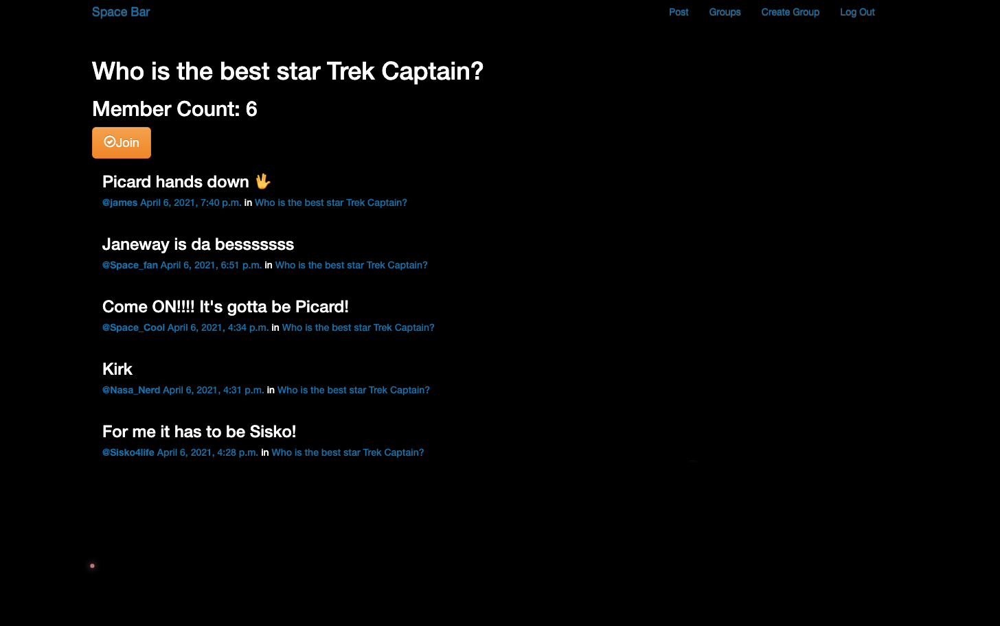

<a href="https://github.com/aharri64/Spacebar" target="_blank">Space Bar Repository</a>

<a href="https://spacebarapp.herokuapp.com/" target="_blank">Space Bar Deployed Site</a>

Space Bar is a space-centric forum style application where users can discuss and mingle with other space-minded users. Any user may create a group, join a group, and make a post on any group to which they are a part of. 

This application was created using django, python, and postgreSQL. It was build within a 7 day solo sprint while attending General Assembly. It utilizes several models in a one-to-many and many-to-many relationships as well as full django authentication.

I am a huge space enthusiast, I love learning and talking about anything space... Fact or Fiction. Please feel free to make an account, make or join a group, and debate who the best Star Trek Captain is.

